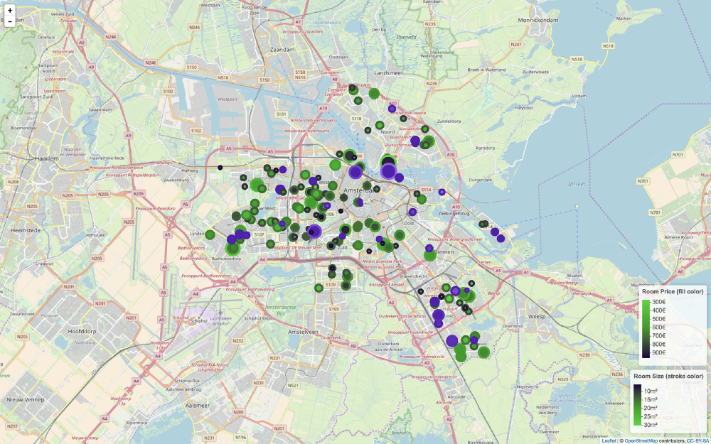

# get-a-room-with-r
Getting a room is hard, visualizing the market with R makes it easier.

# SYNPOSIS

Just create an R project with R Studio or anything else you run R with and run get_a_room.r from the path of this directory, with the included example data the script should generate a leaflet map looking like this:

# ALL INCLUDED

There's poorly anonimized example data under `data/example_rooms.json`.
